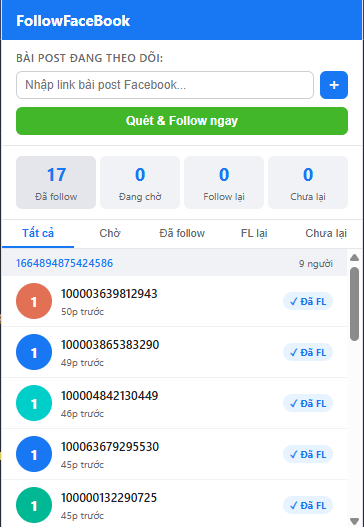

# FollowFaceBook

Chrome Extension tự động follow những người đã comment vào bài post Facebook của bạn.

<p align="center">
  <a href="https://github.com/truonganDevOps/FollowFaceBook/archive/refs/heads/master.zip">
    
  </a>
</p>

<p align="center">
  
</p>

---

## Cài đặt (4 bước)

**Bước 1:** Nhấn nút tải bên trên → giải nén file ZIP vừa tải về.

**Bước 2:** Mở Chrome, vào địa chỉ:
```
chrome://extensions
```

**Bước 3:** Gạt công tắc **Developer mode** ở góc trên bên phải sang **ON**.

**Bước 4:** Nhấn **Load unpacked** → chọn thư mục vừa giải nén.

Extension sẽ xuất hiện với icon **F** màu xanh trên thanh công cụ Chrome.

---

## Cách sử dụng

1. Mở Facebook trên Chrome (phải đang đăng nhập).
2. Nhấn icon extension trên thanh công cụ.
3. Dán link bài post vào ô nhập → nhấn **+**.
4. Nhấn **Quét & Follow ngay** để bắt đầu.

Extension sẽ tự quét comment, xếp hàng và follow từng người tự động. Giới hạn 20 follow/giờ để tránh bị Facebook hạn chế.

---

## Tính năng

- Tự động follow người comment, bỏ qua người đã follow
- Theo dõi trạng thái: đang chờ / đã follow / follow lại / chưa follow lại
- Xóa link post → dừng follow ngay lập tức
- Tự động chạy ngầm mỗi 5 phút để quét comment mới
